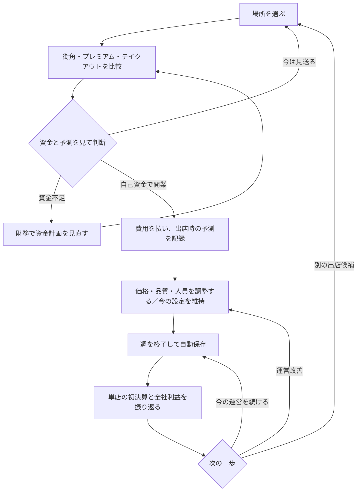

# 成長体験と経営の分岐 — 設計レビュー

0.4.0 は、0.3.2 の出店比較・初決算記録に、資本比較、沿線共同開発の二択、買収候補比較、営業提案の店舗適性を加えています。数字を増やすだけでなく、次に何を選べるか、街に何が残るかを判断できる成長を目指します。計算・保存・描画の検証と、人間の面白さ・所要時間の検証は分けています。

研究資料は [公開資料調査の入口](../research/game-reward-study.md)、[比較ゲームの公式説明と公開レビュー](../research/comparable-games.md)、[桜井資料の整理](../research/sakurai-lessons.md)、[独自短要約一覧](../research/sakurai-summaries.md) から読めます。**桜井関連の要約は原動画・字幕との照合 0 件です。** 取得した第三者記事の読解・校閲を、原動画の視聴や公式原典の確認と同一扱いにしません。一次本文・本人告知・第三者の解説は各資料で区別しています。

## 0.3.2 までの設計履歴

街・建築制作とは別に、GPT-6 Astraの3担当で当時の0.3.1を読み、案への反論と修正を行いました。結果の最初の実装が0.3.2の出店比較と初決算記録です。

| 担当 | 見た範囲 | 発見と修正方針 |
|---|---|---|
| 成長体験 | 初黒字、2号店、任せる楽しさ | 最初から複数店を作れる。強制的に待たせず、選択時の予測と初決算をつなぐ |
| 戦略の分岐 | 借入、増資、配当、業種と統合 | 選べるだけでは分岐にならない。配当ゼロ優位や、増資の弱い代償を後続の再設計課題とする |
| 進行と難易度 | 30時間全体、反復、都市の成長 | 地区完成から鉄道取得まで街の成長が薄い経路がある。同型100件の取得を単純作業にしない |

詳細：[成長体験](growth-experience.md)、[戦略の分岐](strategic-decisions.md)、[キャンペーン進行](campaign-pacing.md)。

## 0.3.2 の合意と実装

調達方法をまとめて実行する案、初委任・IPOまで一度に記録する案、統合後イベントを増やす案も比較しました。最初は、新規出店について一周遊べる仕組みを実装しました。

- 3形態の比較は、同じ週に実行した状態で計算。開業費・支払後資金・利息後利益・週末現金を表示します。
- 既存店の利益低下、本部費、店長なし店舗の運営能力を含めます。利益が増えない案を無理におすすめしません。
- 出店時の単店・全社予測を保存し、最初の営業実績と比較できます。その後の設定変更や別の投資も決算に含まれることを明示します。
- 最近40件の記録を保存。通常の週送り・連続営業・再読込に対応。旧セーブに過去の出店記録を作り足しません。
- 新たな待ち時間、利益へのボーナス、借入による敗北条件の緩和は追加していません。

狙いは「最初の黒字を出した」「2店目も自分の判断で育った」という成果を、数字と街の店舗の両方で分かるようにすることです。これは中後半の経営判断を増やす実装とは別です。

## 0.4.0 で実装した 4 分岐

| 分岐 | いま選べること | 結果・判断の限界 | 詳細 |
| --- | --- | --- | --- |
| 資本比較 | 調達しない／金額と返済期間を選ぶ借入／条件達成後の IPO／上場後の 10% 増資。予定支出と残す現金から不足額も考えられる | 同じ現状へ各操作を単独で適用し、現金・持分・債務・今週利益・元本返済・週末現金を比較。計画メモは投資を実行せず、調達後の投資利益を保証しない | [資本計画](../capital-planning.md) |
| 沿線共同開発 | 上場・信用・地区内の直接保有物件の条件を満たし、4 地区で商業か賃貸の一方を選ぶ、または見送る | 商業は店舗需要、賃貸は外部賃貸物件に作用。満席・自用物件だけなら投資が利益を減らす場合もある。工事中から維持費を払い、計画変更・返金はできない。鉄道会社の取得とは別 | [共同開発](../rail-projects.md)、[街での表示](../rail-visuals.md) |
| 買収候補比較 | 100 候補を検索・並べ替え・予算等で絞り、最大 3 社の独立運営／統合を比較して調査・取得へ進む | 取得費と準備費、稼働までの時間、利益レンジを区別。条件を満たす調査済み案だけ今週の全社予測を出す。3 社同時取得や全期間の利益保証ではない | [買収戦略](../acquisition-strategy.md) |
| 営業提案の適性 | 新しい店舗向け案件に作成時の店舗数・直近決算客数等を反映し、公開される全期間の純収支幅を見て調査・契約・見送りを選ぶ | 客数等は混雑や規模の代理指標。待ち行列・再来店を実測していない。作成時の前提を固定し、旧提案は維持。調査で幅が狭まっても導入前に結果は確定しない | [店舗適性](../deals-context.md)、[営業 UI 検証](../sales-context-playtest.md) |

比較だけでは現金も時間も進めず、実行を別に選びます。借入がある状態で今週の利息後純利益が 0 以下になる敗北条件を維持し、利益と元本返済後の現金を分けて示します。需要増、稼働後利益レンジ、今週の予測を同じ確定値として扱いません。

沿線の工事中・完成・休止は街の形にも反映し、事業カードの「沿線の様子を見る」から地区へ移動できます。初決算からの店舗運営への導線もあります。ただし、数字から実際の店や設備へ目が移り、それを成果と感じるかは人間の観察が必要です。[報酬と導線の相互レビュー](reward-review-v4.md) に、読取時点の成果、受入基準、改善候補 3 件を記録しています。

## 残る課題と次の検証

1. **配当と持分の意味。** 現行は会社の成長に対して配当 0 が有利になりやすく、持分低下の代償も限られます。比較で事実は見えるようになりましたが、この経済構造は未解決です。実装していない創業者個人資産や経営権喪失を、既存の報酬・罰として説明しません。
2. **投資先の文脈を保つ往復。** 資本計画には任意の支出メモがありますが、出店・買収・共同開発で選んだ対象と必要額を財務へ渡し、調達後に元の候補へ戻す一連の引継ぎは未実装です。IPO 後の新しい能力の見せ方、初決算の主役値、長い比較表の情報量も改善候補です。
3. **大量取得の反復。** 絞り込みと 3 社比較で候補選びは短くできても、全 100 件取得が 100 回の異なる判断になるわけではありません。一括調査・一括取得は未実装です。判断を残す部分と同型操作を短縮する部分を、人間の操作記録から決める必要があります。
4. **人間の最初の 15 分と約 30 時間。** 初見で「なぜその案を選んだか」「何が成果だったか」「次にしたいこと」を確認し、その後に通しプレイの時間と中後半の反復を測ります。最初の 15 分で IPO 到達を要求せず、初店の判断・結果・次の選択を観察します。人間による約 30 時間の完遂・楽しさは未検証です。

[戦略 UI 検証](../strategy-v4-playtest.md) は合成状態を使った数値・操作・保存の確認で、3D を置き換えています。[沿線 3D 検証](../rail-visuals.md) は描画を扱い、役割が異なります。[キャンペーン回帰検証](../campaign-v4.md) の 2 シード × 3 経路は通常の公開操作で全目標へ到達しましたが、922〜1,010 はゲーム内週数であり、人間のプレイ時間や意味のある判断回数へ換算しません。

研究で得た提案も受入検証の仮説として扱います。[ゲーム性・設計・UI の 74 項目校閲](../research/sakurai-review-design.md) では、第三者要約の留保と経営ゲームへの適用限界を整理しました。Coffee Inc 2 の自由経営を好む感想と目標不足への不満など、公開レビュー内の反対意見も残し、小標本から全プレイヤーの好みを断定しません。
