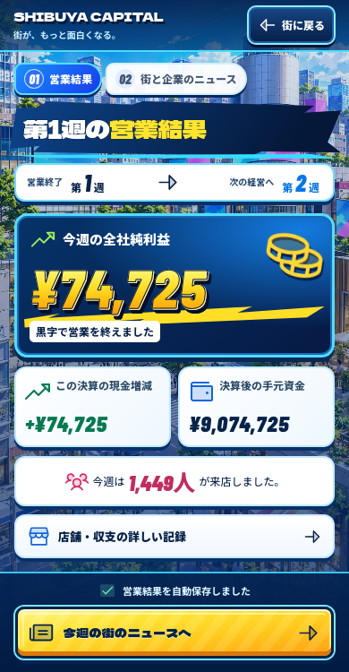
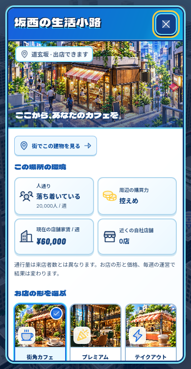

# City Burst：実装画面の比較用キャプチャ

2026-10-07。承認済み[見本B](../../concepts/city-burst-approved.png)と比較するための実装画像です。source `0c1b5e2`、build-03、Linux WebKitの本番CSP・`/-/`配信で撮影しました。390×750と1280×900です。元画像の画素を加工せずコピーしています。

| 営業結果 | 出店 |
| --- | --- |
|  |  |
| [1280pxの営業結果](weekly-1280.png) | [3形態と開業費](property-styles-390.png) |

新会社の通常の資金で開業し、実際に一週を営業した結果です。見本の75,250円を表示するために値を固定していません。数字・記録・操作はゲーム本体が表示しています。背景装飾は専用の生成アート、フォントとSVGアイコンはライセンス付きの原素材です。

最初のnative確認で消えるアイコンとスマホの縦の収まりを指摘し、URL・文字・余白・金額の質感を修正して再撮影しました。親はこの結果画面と出店画面を見比べ、可読性とBの構成への改善を確認しています。Dot D03はAstraで見本との残る差を具体的に指摘してください。銀行・市場・グループの画像は追加します。

提出時点では本番nativeの残りの操作と建物確認が進行中です。画像だけで保存、音、ゲームバランス、Windowsや物理iPhoneの性能が確認済みとは扱いません。元の証拠は `captures.json` に記録します。
